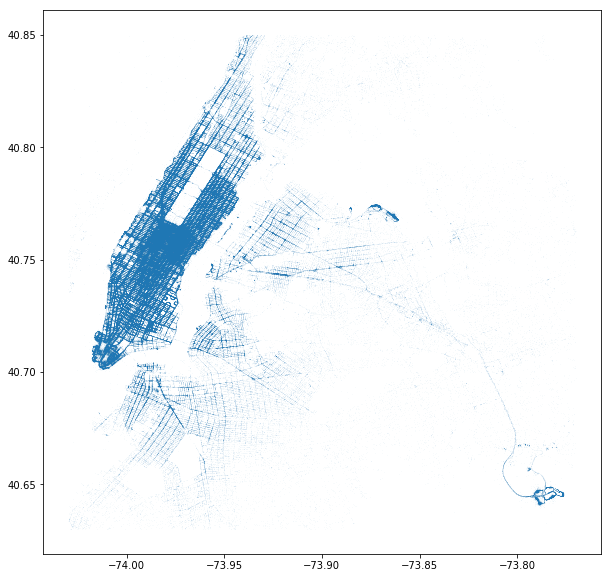
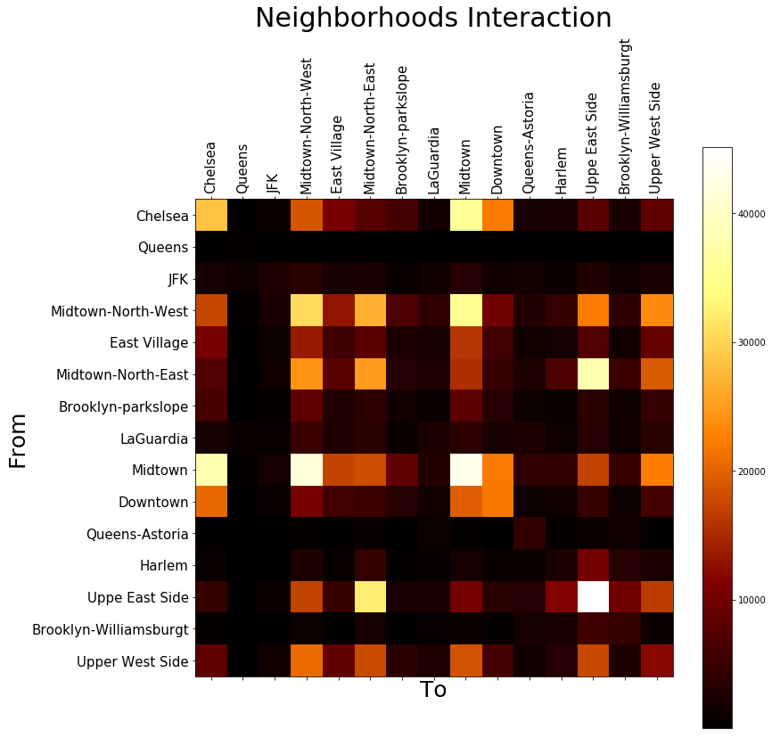

## Where Should Taxi Go
### TDI Project Proposal
Wenyu Wang :books: PhD @ Purdue with :heart: Data Science

***

### Background

* 2016 NYC data published by [TLC](http://www.nyc.gov/html/tlc/html/about/trip_record_data.shtml)
* ~ 20GB available at [Google BigQuery](https://bigquery.cloud.google.com/table/imjasonh-storage:nyctaxi.trip_data)
* 15 Features on Time, Location, and Fares

***

### Motivation

* Taxis are not full-pack all the time. Check [here](http://chriswhong.github.io/nyctaxi/)

* Idle taxis:  :arrow_down_small: efficiency, :arrow_up_small: Traffic-Jam

* Problem: **where should taxi go after a drop?**

* Solution: given any position & time, suggest where an empty cab to go?

***

### Overview

***

### Cluster

***

### Transition

***

### In-Vs-Out

***

### Next

* Finer grid
* Seasonal effect
* Weather effect
* Online recommendations (Uber & Lyft)

***

# Thank you!
